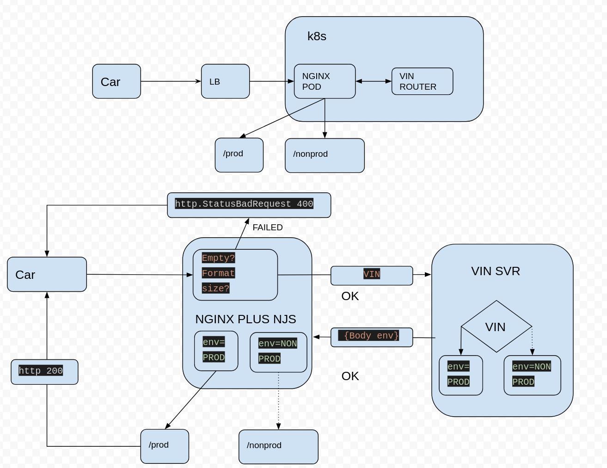

# Zero Downtime Demos with NGINX Ingress

A Zero Downtime demo of [NGINX Ingress 1.9](https://github.com/nginxinc/kubernetes-ingress/tree/release-1.9) using helm deployments

See [setup](setup.md) guide and [demo](demo.md) instructions

Here is what is being demonstrated:

 * [`helm` deployments of NGINX Plus
 Ingress](https://docs.nginx.com/nginx-ingress-controller/installation/installation-with-helm/)
 * Building a Custom [NGINX Plus Ingress Controller
 image](https://github.com/nginxinc/kubernetes-ingress/blob/master/build/DockerfileForPlus)
 * Customizing [NGINX Plus Ingress Controller Deployment
 Spec](https://github.com/nginxinc/kubernetes-ingress/blob/master/deployments/helm-chart/templates/controller-deployment.yaml)
 * Using the new load balancing configurations [`VirtualServer` and
   `VirtualServerRoute` resources](https://docs.nginx.com/nginx-ingress-controller/configuration/virtualserver-and-virtualserverroute-resources/)
 * NGINX Ingress Controller [Dynamic
   reconfiguration](https://github.com/nginxinc/kubernetes-ingress/blob/master/docs/nginx-plus.md)
   with service discovery of scaling services updated on-the-fly without
   reloading the configuration without any reloads
 * Updates to `virtualServer` and `virtualServerRoute` are picked up by NGINX
   Ingress dynamically without a `helm upgrade`and  triggers a graceful reload
   of NGINX only
 * Updates to Helm Values require a `helm upgrade`  and
   triggers [graceful reload](https://docs.nginx.com/nginx/admin-guide/basic-functionality/runtime-control/) of NGINX only
 * Updates to ConfigMaps Mounted on NGINX Pods require a `helm upgrade` and
   triggers Zero Downtime  deployment of new NGINX Ingress pods. No change to
   `loadBalancer` and its External IP addresses
 * All config pushes are tested by NGINX (`nginx -t`) and any invalid configs
   are ignored and no updates and reloads are trigged on NGINX Ingress pods.

We will use the "Vinrouter" use case to demonstrate this

